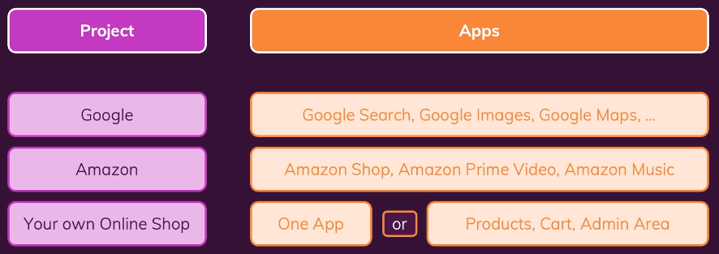
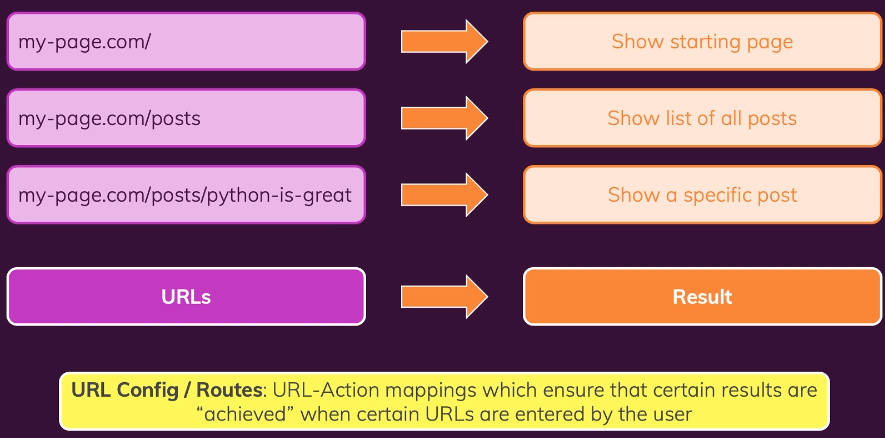
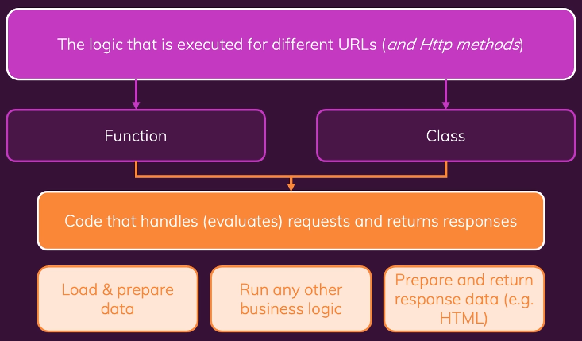
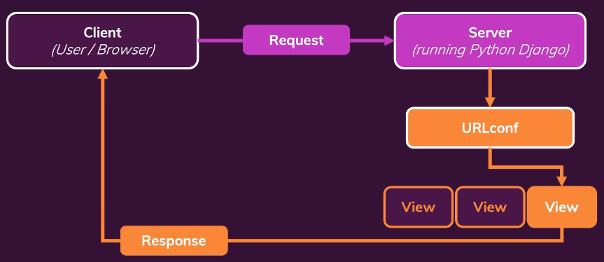
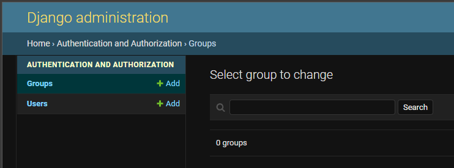
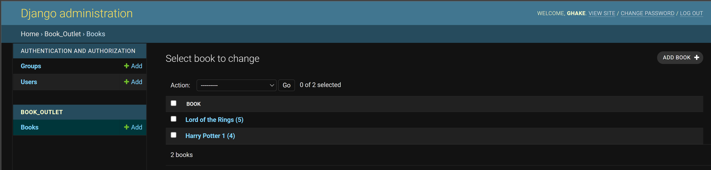
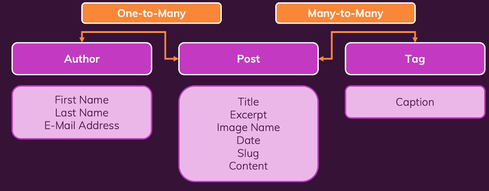

# Django Bootcamp

1. Python web development framework
1. Python 3.x
1. Customizable and extensible

## Django Setup

1. Install [Python](https://www.python.org/downloads/)
1. Install Django
   ```
   pip install Django
   ```
1. Confirm Django installed
   ```
   django-admin
   ```
1. Create a Django project
   ```
   django-admin startproject
   ```
1. Formatting and Linting
   ```
   pip install pylint
   ```
   ```
   pip install autopep8
   ```
   - I ran into issues w/ prettier and autopep
   - Had to disable prettier and make sure autopep was the formatter for python
1. Launch development server
   ```
   python manage.py runserver
   ```
1. In Django, modules are called **Apps**
   ```
   python manage.py startapp challenges
   ```
   
   - Can scale up and down in terms of size
1. [Virtual Environments](https://docs.python.org/3/tutorial/venv.html)
   - It is recommended to use a virutal environment when developing in Django (and python in general)

# URLs and Views

## URLs/Routes



## Views



## Request Response Flow



## Simple View and URL

How do views and urls (and apps) all work together?

Below are code snippets of a simple view/url pairing

1. We crated a challenges app in the 02-monthly-challenges project
   - So at this point, we have the challenges and monthly_challenges apps
1. Inside the challenges app we created a simple view and url
1. ```urls.py``` (we had to manually add this)
   ```py
   from django.urls import path
   from . import views

   urlpatterns = [
      path("january", views.index)
   ]
   ```
   - This will route to /challenges/january
   - We don't need the /challenges portion here
1. ```views.py```
   ```py
   from django.shortcuts import render
   from django.http import HttpResponse

   # Create your views here.


   def index(request):
      return HttpResponse("This works!")
   ```
   - We can return an html page as well here!
1. Linking the apps together
   - monthly_challenges > ```urls.py```
   ```py
   from django.contrib import admin
   from django.urls import path, include

   urlpatterns = [
      path('admin/', admin.site.urls),
      path("challenges/", include("challenges.urls"))
   ]
   ```
   - This is why we didn't need to include the challenges/ in the above url def
   
## Dynamic Path Segments and Captured Values

So, with our monthly challenges example, it's cumbersome to add a view and a url for each month

Say you don't know all the urls you may have...

1. challenges > ```urls.py```
   ```py
   from django.urls import path
   from . import views

   urlpatterns = [
      path("<month>", views.monthly_challenge)
   ]
   ```
   - month becomes our dynamic url value (it's a variable)
   - url = ```/challenges/<month>``` where ```<month>``` will be replaced with whatever the value is
      - ```/challenges/january```
1. challenges > ```views.py```
   ```py
   from django.shortcuts import render
   from django.http import HttpResponse, HttpResponseNotFound

   # Create your views here.


   def monthly_challenge(request, month):
      challenge_text = None

      if month == 'january':
         challenge_text = "Eat no meat for the entire month"
      elif month == 'february':
         challenge_text = "Walk for at least 20 minutes every day!"
      elif month == 'march':
         challenge_text = "Learn Django for at least 20 minutes every day!"
      else:
         return HttpResponseNotFound("This month is not supported!")

      return HttpResponse(challenge_text)
   ```
   - We use a single function and interrogate the month param
   - If we named the url parameter differently above, we'd need to name it to match here

### Path Converters

[Official Documentation](https://docs.djangoproject.com/en/3.1/topics/http/urls/#path-converters)

```py
from django.urls import path
from . import views

urlpatterns = [
    path("<int:month>", views.monthly_challenge_by_number),
    path("<str:month>", views.monthly_challenge)
]
```
```py
def monthly_challenge_by_number(request, month):
    return HttpResponse(month)
```

Allows you to specify the type of path variable

## Redirects

```py
from django.shortcuts import render
from django.http import HttpResponse, HttpResponseNotFound, HttpResponseRedirect
```
```py
def monthly_challenge_by_number(request, month):
    months = list(monthly_challenges.keys())

    if month > len(months):
        return HttpResponseNotFound("Invalid month")

    redirect_month = months[month - 1]

    return HttpResponseRedirect("/challenges/" + redirect_month)
```

## Reverse Function & Named URLs

The idea is that we name a url instead of hardcoding

```py
urlpatterns = [
    path("<int:month>", views.monthly_challenge_by_number),
    path("<str:month>", views.monthly_challenge, name="month-challenge")
]
```
```py
from django.urls import reverse

def monthly_challenge_by_number(request, month):
    months = list(monthly_challenges.keys())

    if month > len(months):
        return HttpResponseNotFound("Invalid month")

    redirect_month = months[month - 1]
    redirect_url = reverse("month-challenge", args=[redirect_month])

    return HttpResponseRedirect(redirect_url)
```

# Templates & Static Files

1. Create a folder for your templates inside an app
   - challenges > templates > challenges > challenge.html
1. Register the app w/ Django
   - settings.py
   ```py
   # Application definition

   INSTALLED_APPS = [
      'challenges',
      'django.contrib.admin',
      'django.contrib.auth',
      'django.contrib.contenttypes',
      'django.contrib.sessions',
      'django.contrib.messages',
      'django.contrib.staticfiles',
   ]
   ```
1. Use the template in your view
   - challenges > views.py
   ```py
   from django.template.loader import render_to_string

   response_data = render_to_string("challenges/challenge.html")
   return HttpResponse(response_data)
   ```
1. Best practice to repeat app name in templates folder of app

## Django Template Language

1. Enhance HTML files to create dynamic pages
   - Standard HTML Syntax + Special DTL Syntax = Dynamic HTML Page
1. Example
   ```html
   <body>
      <h1>{{ month_name }}'s Challenge</h1>
      <h2>{{ text }}</h2>
   </body>
   ```
   ```py
   challenge_text = monthly_challenges[month]
   return render(request, "challenges/challenge.html", {
      "text": challenge_text,
      "month_name": month.capitalize()
   })
   ```

## Filters

1. [Official Documentation](https://docs.djangoproject.com/en/3.2/ref/templates/builtins/)
1. Allows us to apply 'code' in our html docs
   ```html
   <body>
      <h1>{{ month_name|title }}'s Challenge</h1>
      <h2>{{ text }}</h2>
   </body>
   ```

## Tags

Example is to allow us to loop through content

```html
<ul>
   
      <li><a href=""></a></li>
   
</ul>
```

## Template Inheritance

Allows us to define a base template that other templates can inherit from

1. Project Root > templates > base.html
   ```html
   <!DOCTYPE html>
   <html lang="en">
   <head>
      <meta charset="UTF-8">
      <meta http-equiv="X-UA-Compatible" content="IE=edge">
      <meta name="viewport" content="width=device-width, initial-scale=1.0">
      <title>My Challenges</title>
   </head>
   <body>
      
   </body>
   </html>
   ```
   - Notice the block tags
1. Updating file w/ template inheritance
   ```html
   

   All Challenges
      
   
      <ul>
         
            <li><a href="">{{ month|title }}</a></li>
         
      </ul>
   
   ```
1. Update settings so you don't have to point to literal path to ```base.html```
   ```py
   'DIRS': [
      BASE_DIR / "templates"
      # BASE_DIR / "challenges" / "templates"
   ],
   ```
   - This allows Django to look into the templates folder for any django template

## Partial Template Snippets

1. Create the partial: templates > challenges > includes > header.html
   - Create your partials in the app you are using them in
   ```html
   <header>
      <nav>
         <a href="">All Challenges</a>
      </nav>
   </header>

   {{ active_page }}
   ```
   - active_page is a variable we can set when using this partial in other templates

1. Using the partial
   ```html
   

   All Challenges
      
   
      

      <ul>
         
               <li><a href="">{{ month|title }}</a></li>
         
      </ul>
   
   ```
   - Notice the include tag
   - the ```with active_page``` section is where we set that variable 

## Static Files (javascript, css)

1. Create a ```static``` folder in your app
   - challenges > static > challenges > challenges.css
1. These settings are default, but confirm
   ```py
   INSTALLED_APPS = [
    'challenges',
    'django.contrib.admin',
    'django.contrib.auth',
    'django.contrib.contenttypes',
    'django.contrib.sessions',
    'django.contrib.messages',
    'django.contrib.staticfiles',
   ]
   ```
   ```py
   # Static files (CSS, JavaScript, Images)
   # https://docs.djangoproject.com/en/3.2/howto/static-files/

   STATIC_URL = '/static/'
   ```
1. Use the static files in a template
   ```html
   

   
      <link rel="stylesheet" href="">
   
   ```

### Global Static Files

1. Similar to app based static files, except we are doing this for the whole project
   - root > static > styles.css
1. We need to update a setting in ```settings.py```
   ```py
   STATIC_URL = '/static/'
   STATICFILES_DIRS = [
      BASE_DIR / "static"
   ]
   ```
   - This allows Django to look for static files in the root dir
1. Then use this global style in our global templates

### Build Static Urls Dynamically

1. You want to build a static url where a part of the url (filename) is a stored variable
   ```ps
   
   ```
   - This fails
1. Instead, use the add filter
   ```ps
   
   ```

# Data, Models, SQL

1. Django already creates a sqlite file
   - Which is what we will be using
1. [sqlite docs](https://www.sqlite.org/index.html)
1. With Django, there's a built in feature to interface w/ databases
   - Models

## Django Models

1. Define data models and use objects based on those models to run common operations
1. Django models translate instructions (written in Python) to SQL queries
1. [Model Field Reference](https://docs.djangoproject.com/en/3.2/ref/models/fields/)

```py
from django.db import models

# Create your models here.


class Book(models.Model):
    title = models.CharField(max_length=50)
    rating = models.IntegerField()

   def __str__(self):
   return f"{self.title} ({self.rating})"
```

1. Django will auto create an id field that auto increments
1. Django will create a ```Books``` table (pluralizes it)

## Migrations

1. As always, you have to hook up your project ```book_outlet``` to the ```settings.py``` file so Django is aware of it
1. In the project folder rund
   ```cmd
   python manage.py makemigrations
   ```
1. This will build migrations from ```model.ps``` classes
   - Nothing has been ran yet!
1. Run the below command to run the migration
   ```cmd
   python manage.py migrate
   ```
1. After updating a model, you'll need to have Django create a new migration and apply
   - Same as above ```makemigrations```

## Database Manipulation

The below shell commands will eventually be actually coded into a view

1. Interact with database through Python: Insert
   ```cmd
   python manage.py shell
   ```
   ```py
   from book_outlet.models import Book
   ```
   ```py
   harry_potter = Book(title="Harry Potter 1 - The Philosopher's Stone", rating=5)
   ```
   ```py
   harry_potter.save()
   ```
   - Django will create an insert query
1. Get Data
   ```py
   Book.objects.all()
   ```
   - Returns a 'QuerySet'
1. Update Data
   ```py
   from book_outlet.models import Book
   harry_potter = Book.objects.all()[0]

   harry_potter.author = 'J.K. Rowling'
   harry_potter.is_bestselling = True
   
   harry_potter.save()
   ```
   - If item already exists, it will update instead of insert
1. Delete data
   ```py
   from book_outlet.models import Book
   harry_potter = Book.objects.all()[0]

   harry_potter.delete()
   ```
1. Create Data
   ```py
   from book_outlet.models import Book

   Book.objects.create(title="Harry Potter 1", rating=5, author="J.K. Rowling", is_bestselling=True)
   ```
1. Query Data
   ```py
   from book_outlet.models import Book

   Book.objects.get(id=3)
   Book.objects.get(title="My Story")
   ```
   - Only gets 1 item, even if criteria matches multiple items
   - Throws error if multiple are returned
   ```py
   Book.objects.filter(is_bestselling=True)
   Book.objects.filter(is_bestselling=True, rating=2)
   Book.objects.filter(rating__lt=3)
   ```
   - Returns QuerySet
   - [Django Filter](https://docs.djangoproject.com/en/3.2/topics/db/queries/)
1. Query 'or' 'and' Condition
   ```py
   from book_outlet.models import Book
   from django.db.models import Q

   Book.objects.filter(Q(rating__lt=3) | Q(is_bestselling=True))
   ```
   ```py
   from book_outlet.models import Book
   from django.db.models import Q

   Book.objects.filter(Q(rating__lt=3) | Q(is_bestselling=True), Q(author="J.K. Rowling"))
   ```
   - You don't have to use the ```Q``` if you are using and, but if you don't, it has to come after an 'or' condition
1. Bulk Operations
   - [Delete](https://docs.djangoproject.com/en/3.1/topics/db/queries/#deleting-objects)
   - [Update](https://docs.djangoproject.com/en/3.0/ref/models/querysets/#bulk-update)
   - [Create](https://docs.djangoproject.com/en/3.0/ref/models/querysets/#bulk-create)
1. blank vs null
   - ```blank=True```: When providing a value for this model field (via a form)
      - This field may be blank
   - ```null=True```: When no value is received for that field
      - NULL is stored in db
      - char types store empty string

## Django Admin

GUI for working with data

[Django Admin](https://docs.djangoproject.com/en/3.2/ref/contrib/admin/)

1. In the project folder ```book_store```, in the ```urls.py```
   - You'll notice an admin url
   ```py
   urlpatterns = [
      path('admin/', admin.site.urls),
      path('', include('book_outlet.urls'))
   ]
   ```
   - Coming from ```django.contrib.admin```
1. Go to root/admin/
   - What is the username or password?
   - First you have to create a super user
   ```py
   python manage.py createsuperuser
   ```
   
1. How to get the admin page to see our db?
   - ```book_outlet\admin.py```
   ```py
   from django.contrib import admin

   from .models import Book

   # Register your models here.

   admin.site.register(Book)
   ```
   
   - Can add, edit, delete

## Relationships

[Documentation](https://docs.djangoproject.com/en/3.2/topics/db/models/#relationships)

### Model Definitions

```py
class Country(models.Model):
    name = models.CharField(max_length=80)
    code = models.CharField(max_length=2)

    def __str__(self):
        return self.name

    class Meta:
        verbose_name_plural = 'Countries'


class Address(models.Model):
    street = models.CharField(max_length=80)
    postal_code = models.CharField(max_length=5)
    city = models.CharField(max_length=50)

    def __str__(self):
        return f'{self.street}, {self.postal_code}, {self.city}'

    class Meta:
        verbose_name_plural = 'Address Entries'


class Author(models.Model):
    first_name = models.CharField(max_length=100)
    last_name = models.CharField(max_length=100)
    address = models.OneToOneField(
        Address, on_delete=models.CASCADE, null=True)

    def full_name(self):
        return f'{self.first_name} {self.last_name}'

    def __str__(self):
        return f'{self.first_name} {self.last_name}'


class Book(models.Model):
    title = models.CharField(max_length=50)
    rating = models.IntegerField(
        validators=[MinValueValidator(1), MaxValueValidator(5)])
    author = models.ForeignKey(
        Author, on_delete=models.CASCADE, null=True, related_name="books")
    is_bestselling = models.BooleanField(default=False)
    slug = models.SlugField(default="", blank=True,
                            null=False, db_index=True)
    published_countries = models.ManyToManyField(Country)

    def get_absolute_url(self):
        return reverse("book-detail", args=[self.slug])

    def __str__(self):
        return f"{self.title} ({self.rating})"

```

1. One to Many
   ```py
   author = models.ForeignKey(
        Author, on_delete=models.CASCADE, null=True, related_name="books")
   ```
   - ForeignKey is used for this relationship
1. One to One
   ```py
   address = models.OneToOneField(
        Address, on_delete=models.CASCADE, null=True)
   ```
1. Many to Many
   ```py
   published_countries = models.ManyToManyField(Country)
   ```
   - Like any many to many relationship, this will auto create a mapper table between Book and Country

There are specific ways you can manage/create this data in the shell. Instead of writing it all down, it's in the documentation

We will eventually be doing this in the Django app (once we have forms) anyways

### Admin Definitions

```py
# Register your models here.


class BookAdmin(admin.ModelAdmin):
    prepopulated_fields = {'slug': ('title',)}
    list_filter = ('author', 'rating')
    list_display = ('title', 'author')


admin.site.register(Book, BookAdmin)
admin.site.register(Author)
admin.site.register(Address)
admin.site.register(Country)
```

- Admin sits on top of the created db, so will auto generate controls based on relationship type
- Above in the model definitions you can see
   ```py
   class Meta:
      verbose_name_plural = 'Address Entries'
   ```
- This lets us change how things appear in admin (pural names, etc)
   - As alwyas, docs have more info

### Circular & Lazy Relations

- Sometimes, you might have two models that depend on each other - i.e. you end up with a circular relationship.
- Or you have a model that has a relation with itself.
- Or you have a model that should have a relation with some built-in model (i.e. built into Django) or a model defined in another application.

1. Two models that have a circular relationship
   ```py
   class Product(models.Model):
   # ... other fields ...
   last_buyer = models.ForeignKey('User')
   
   class User(models.Model):
   # ... other fields ...
   created_products = models.ManyToManyField('Product')
   ```
   - In this example, we have multiple relationships between the same two models. Hence we might need to define them in both models. 
   - By using the model name as a string instead of a direct reference, Django is able to resolve such dependencies.
1. Relation with the same model
   ```py
   class User(models.Model):
   # ... other fields ...
   friends = models.ManyToManyField('self') 
   ```
   - The special self keyword (used as a string value) tells Django that it should form a relationship with (other) instances of the same model.
1. Relationships with other apps and their models (built-in or custom apps)
   ```py
   class Review(models.Model):
   # ... other fields ...
   product = models.ForeignKey('store.Product') # '<appname>.<modelname>'
   ```
   - You can reference models defined in other Django apps (no matter if created by you, via python manage.py startapp <appname> or if it's a built-in or third-party app) by using the app name and then the name of the model inside the app.

# Blog Data Models



# Django Forms

[Official Docs](https://docs.djangoproject.com/en/3.2/topics/forms/)

## CSRF Protection

Cross Site Request Forgery: All about requests that look valid, but aren't

1. The idea is to 'rebuild' a form that looks offiical but hosted on your server
   - Then a user uses 'your' app to send protected data
1. You then send that data to the bank
   - Allows you to then get data sent to you instead of bank once hack is complete
1. The fix is to create a token so that if someone spoofs our site, it will be missing
1. Our server will then won't accept the request
1. With Django, it's easy to add this
   ```html
   <form method="POST">
        
        <label for="username">Your Name</label>
        <input id="username" name="username" type="text">
        <button>Send</button>
    </form>
   ```

## Form Submission and Extracting Data

```py
from django.http import HttpResponseRedirect
from django.shortcuts import redirect, render

# Create your views here.


def review(request):
    if request.method == 'POST':
        entered_username = request.POST['username']
        print(entered_username)

        return HttpResponseRedirect('/thank-you')

    return render(request, "reviews/review.html")


def thank_you(request):
    return render(request, 'reviews/thank_you.html')
```

1. Review is our post request
   - Get the data directly from the requests' POST variable
   - Access by the id you gave to the input
1. thank_you is our get
   - We do a Redirect from the post as we don't return html from a post
   - Instead we redirec to a get function

## Manual Form Validation

This is an example of manual form validation before we see what Django Forms do for us

```py

def review(request):
    if request.method == 'POST':
        entered_username = request.POST['username']

        if entered_username == '' and len(entered_username) >= 100:
            return render(request, "reviews/review.html", {
                'has_error': True
            })

        print(entered_username)

        return HttpResponseRedirect('/thank-you')

    return render(request, "reviews/review.html", {
        'has_error': False
    })
```

This should show you that manual validation is...code heavy

It would be nice if we had built in helpers

## Django Form Class

### Django Form

```py
from django import forms


class ReviewForm(forms.Form):
    user_name = forms.CharField()
```

### View With Django Form

```py
from .forms import ReviewFormaAZz

# Create your views here.


def review(request):
    if request.method == 'POST':
        form = ReviewForm(request.POST)

        if form.is_valid():
            print(form.cleaned_data)
            return HttpResponseRedirect('/thank-you')

    else:
        form = ReviewForm()

    return render(request, "reviews/review.html", {
        'form': form
    })
```
 Notice the built in validation functions

### HTML With Django Form

```html
<form action="/" method="POST">
   
   {{ form }}

   <button>Send</button>
</form>
```

## Customizing Django Form

```py
class ReviewForm(forms.Form):
    user_name = forms.CharField(
        label='Your Name', max_length=100,
        error_messages={'required': 'Your name must not be empty',
                        'max_length': 'Please enter a shorter name'})
```

## Customizing Rendred HTML

### Original

```html
<form action="/" method="POST">
   
   {{ form }}
   <button>Send</button>
</form>
```

### Customized

```html
<form action="/" method="POST">
   

   <div class="form-control errors">
      {{ form.user_name.label_tag }}
      {{ form.user_name }}
      {{ form.user_name.errors }}
   </div>

   <button>Send</button>
</form>
```

It's one or the other. Either the entire form, or everything broken apart